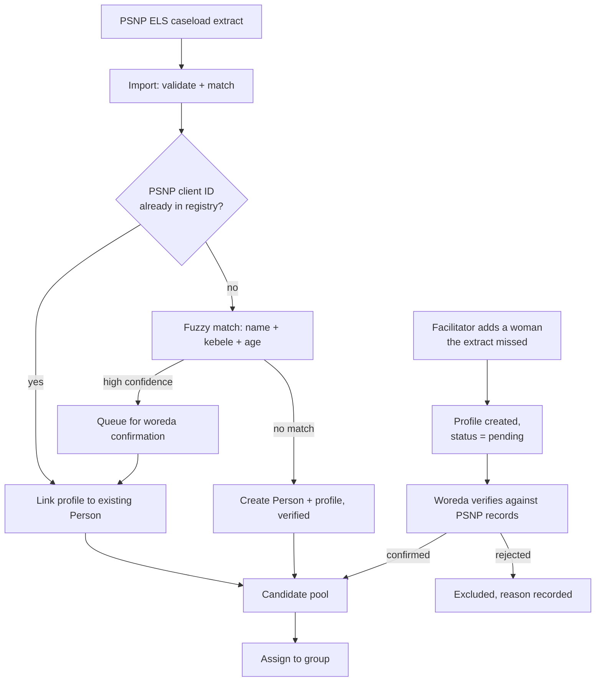
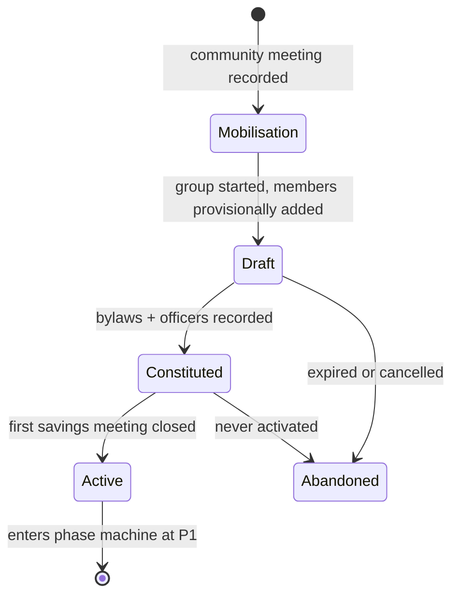
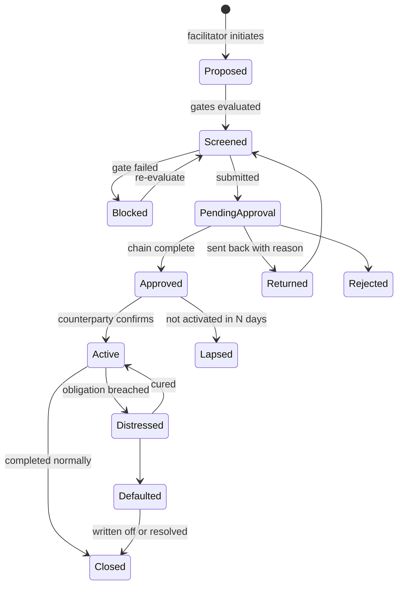

# WLT Group Module: specification

Consolidated spec for the `wlt` module. `DECISIONS.md` has the decisions and rejected alternatives, `DEFINITIONS.md` the formulas, `BACKLOG.md` the stories, `sql/` the verified schema. This document is the architecture and the workflows.

---

## 1. Scope

**In scope.** A Django app carrying the group domain: SHG formation, membership, meetings, savings and loan ledger, phase progression, CLA and federation structures, and every linkage pathway in Section 4 of the source handbook.

**Out of scope.** Changes to the youth case management domain. The core keeps its person-centred case model, with one exception: the referral subject becomes polymorphic (stage 0).

**Deferred.** Member-facing mobile app. Federation UI. Digital payments integration. Automated data exchange with financial service providers.

---

## 2. Module boundary

### 2.1 Why separate

The two domains disagree on the primary subject. The core answers "what is happening to this person". This module answers "what is happening to this group". Forcing group semantics into the case model would mean nullable group columns on `Case`, a referral engine that sometimes points at a person and sometimes at a collective, and a permissions model that cannot express "read this group's ledger but not its members' case files".

Separate app, same database, same auth, shared platform services. Not a separate deployment.

### 2.2 Consumed from core

| Capability | Use | Coupling |
|---|---|---|
| `core.Person` | A member is a Person. The module creates no person table | Read + create via core service |
| PSNP client ID | Join key for eligibility and MIS reconciliation | Read-only |
| Geography hierarchy | Region, woreda, kebele. Groups, CLAs, federations anchor to it | Read-only FK |
| AuthN / users | WLT facilitators are platform users | Shared |
| RBAC scoping | Geographic scoping already exists. Extend with object scoping | Extend, do not fork |
| Referral engine | Reused for service linkage. The load-bearing decision | Extend to accept a group subject |
| Audit log | Every ledger and phase event | Shared |
| Reporting layer | Materialized views, refresh orchestration | Extend |
| Notification / queue | Facilitator reminders, approval routing | Shared |
| Offline sync | Meeting capture. If core has none, this is platform work | Shared or new |

### 2.3 Owned outright

Beneficiary profile, group, membership, office holders, bylaws, mobilisation events, meetings, attendance, ledger, loans, repayments, phase history, risk flags, CLA, federation, formation events, structural membership, delegates, policy parameters, enrolment allocations.

### 2.4 Direction of dependency

`wlt` depends on `core`. **`core` must not import from `wlt`.** The referral subject FKs create a `referrals → wlt` dependency; that direction is acceptable and deliberate. Do not solve any coupling problem with a reverse import into `core`.

---

## 3. Registry and enrolment

### 3.1 Person stays untouched

`core.Person` is the single identity. WLT-specific attributes live in `wlt.beneficiary_profile`, one-to-one. Nothing WLT-specific goes on `Person`. This means the youth side and the WLT side can never disagree about who someone is.

### 3.2 What the profile carries

The youth registration form was built for youth employment. It will not have PSNP client ID, ELS completion, grant receipt, primary IGA, literacy level, digital literacy or device access. The last four are selection criteria in handbook section 3.3, so without them the "at least one member with a device" rule is unenforceable.

### 3.3 Eligibility, two layers

**Programme eligibility** (can she join WLT at all): female, active PSNP livelihoods beneficiary, ELS package completed, grant received. Computed, cached, recomputed on profile change.

**Group fit** (should she join *this* group): same or adjacent kebele, similar socio-economic status, no active conflict, willing to commit. These are facilitator judgements. Surface them as prompts, **never as hard blocks**. The handbook is explicit that participation is voluntary and members are not pressured into a particular group. A system that auto-assigns would break that principle.

### 3.4 Hybrid enrolment



Four rules:

1. PSNP client ID is the primary match key. A missing ID needs manual resolution, not a guess.
2. **Never auto-merge on a fuzzy match.** Merging two different women is worse than a duplicate.
3. Facilitator exceptions start `pending` and cannot join a group until a woreda officer verifies. This control stops the exception path becoming the main path.
4. Duplicate detection runs on assignment, not only on import. The realistic failure is the same woman entering through both routes in the same week.

### 3.5 Allocation ceiling

The pre-pilot has a hard 5,000 ceiling with regional allocations: Somali 1,600 (80 groups), Amhara 1,200 (60), Afar 1,000 (50), Central Ethiopia 908 (45), Dire Dawa 292 (15).

Warn at 90%. Block group activation past the ceiling unless a region-level override is recorded with a reason. Allocations are policy data, not constants.

---

## 4. Group formation

### 4.1 States



A group is not real until it has saved money. `Active` is when the phase machine takes over and P1 begins.

### 4.2 Steps, mapped to handbook 3.4

| Step | Ref | System behaviour |
|---|---|---|
| 1. Community meeting | 3.4(1) | `MobilisationEvent`: kebele, date, attendee counts by category, endorsement yes/no. No individual names beyond the facilitator |
| 2. Members-only meeting | 3.4(2) | Open a `Draft`. Pull the candidate pool for that kebele. Facilitator selects. Fit prompts shown, not enforced |
| 3. Roster validation | 3.3, 3.4 | Hard blocks and soft warnings, see 4.3 |
| 4. Bylaws | 3.4(3) | `BylawVersion` v1. Local-language clauses stored alongside structured fields |
| 5. Officer election | 3.4(4) | Chair, secretary, treasurer with term start. Rotation period from bylaws |
| 6. Constitution | 3.4 | Roster locks. Later changes go through the membership change flow |
| 7. Bookkeeper training | 3.4(5) | `TrainingEvent` against the group and named members. A Phase 1 evidence item, so it is data not a note |
| 8. First savings meeting | 3.4(6) | Normal meeting flow. Balanced close moves the group to `Active`, phase `p1` |

Everything above works offline. Formation happens in a kebele, not in an office.

### 4.3 Hard blocks and soft warnings

Getting this split wrong is the most likely way to make the module unusable in the field.

**Hard blocks:** member not programme-eligible; profile pending or rejected; already in an active group; fewer than 15 members; no treasurer.

**Soft warnings, overridable with a recorded reason:** roster outside 18 to 22; no member with basic literacy; no member with a device or digital literacy; members drawn from more than one kebele; regional allocation above 90%.

Every override writes a `ValidationOverride` row. Reviewed at woreda level, and it also tells you which validation rules are wrong for the field.

### 4.4 Failure paths

| Scenario | Handling |
|---|---|
| Draft never constituted | Expires after 60 days. Members return to the pool. The draft is retained, not deleted |
| Woman appears in two drafts | Second draft blocks at selection with a pointer to the first. Whichever constitutes first wins |
| Constituted but no savings meeting | Expires after 30 days. Reported: three abandoned constitutions in a kebele is a mobilisation problem |
| Member leaves before constitution | Edit the draft freely |
| Community endorsement refused | Recorded against the `MobilisationEvent` and closed |

That last row matters. A system that records only successful formations cannot explain why some kebeles produced none.

### 4.5 Membership changes after activation

Dated, reasoned, never destructive. Join requires eligible, verified, no open membership elsewhere; her compliance counts from her join date. Exit requires a reason code and is **blocked while she has an outstanding loan** until settled, written off with approval, or transferred.

All indicators compute against the roster as it stood on each meeting date. That is why membership is a dated range and not a flag.

---

## 5. Meetings and ledger

### 5.1 The module becomes a financial system of record

Handbook annexes 1 to 4 are a savings-and-credit ledger: minute book, cashbook, individual passbook, loan ledger. Digitising them raises the bar above case tracking.

### 5.2 Reconciliation

A meeting cannot close on an unbalanced till. The trigger names the discrepancy in birr rather than failing generically. A failed reconciliation raises an at-risk flag.

### 5.3 Append-only

Every entry carries who and when. Corrections are **reversals referencing the original with a mandatory reason**, never edits. Members sign the paper register; the digital record has to be defensible against it. `UPDATE` and `DELETE` are blocked at the database.

### 5.4 Paper stays primary in the pilot

Run digital in parallel and reconcile. Do not build a flow that assumes paper is gone. In a comparable Uganda pilot, groups that lost their single smartphone abandoned the system entirely.

### 5.5 Service charge

Basis is **nullable with no default**, so the system cannot silently pick one. A flat 5% per loan and 5% per month on a three-month loan differ by a factor of three. Basis and rate are frozen on the loan at disbursement, not read live from the bylaw.

The per-group label ("service charge" or "interest") applies in every UI surface and export. Handbook 3.5 offers the alternative term for religious inclusivity while the annex loan ledger still says "Interest"; the label is a setting, and the annexes need fixing.

---

## 6. Linkage

### 6.1 Two kinds, often conflated

| | **Structural** (vertical) | **Service** (external) |
|---|---|---|
| Examples | SHG joins a CLA, CLA joins a federation | bank account, MFI facility, cooperative, buyer agreement, service referral |
| Cardinality | one parent at a time | many concurrent |
| Exclusivity | exclusive | non-exclusive |
| Carries | governance, delegates, voting | obligations, money, contract terms |
| Created by | a multi-party formation event | a per-subject application |
| Ends by | withdrawal, dissolution, merge | closure, maturity, default, termination |
| Reversibility | rare and significant | routine |

### 6.2 Structural linkage

`wlt.structural_membership`, with a partial unique index enforcing one open parent per child and a check constraint enforcing the hierarchy: a CLA contains groups, a federation contains CLAs, never groups directly. Rows are created **only** by a `FormationEvent`, never by direct write.

`wlt.delegate` holds the two representatives each SHG elects into its CLA, dated, with rotation history.

### 6.3 Service linkage rides the referral engine

A service linkage is structurally identical to a referral: a subject connected to an external provider, a lifecycle, dated events with actors and notes, and a timeline the field worker wants to see. The only difference is the subject type.

So it reuses the existing engine, the timeline component, the provider directory and the reporting. Building a parallel linkage system beside an existing referral system is duplicated logic that will drift.

### 6.4 Linkage taxonomy

Type is data, not a class hierarchy. Seeded in `003_policy_seed.sql`.

| Type | Subject | Earliest phase | Approval chain |
|---|---|---|---|
| `savings_account` | group, CLA, federation | P2 | woreda |
| `market_offtake` | group, CLA, federation | P2 | woreda |
| `service_referral` | person, group | any | facilitator |
| `cooperative_membership` | group, CLA | P3 | woreda → region |
| `cooperative_registration` | federation | P4 | region → federal |
| `credit_facility` | **CLA, federation only** | P4 | woreda → region → federal |
| `protection_referral` | **person only**, restricted | any | woreda |

Two deliberate choices. `credit_facility` is the pathway the Ethiopian evidence warns about, so it carries the longest chain and cannot take a group subject in the pilot. `protection_referral` permits `person` only, which is how handbook section 3.6's confidentiality norm becomes a database constraint rather than a convention: a GBV disclosure can never land on a group timeline.

### 6.5 Lifecycle

One state machine for all service linkage types. Types vary by gate and approval chain, not by lifecycle.



Five rules:

1. **Gates evaluated at screening and again at approval.** A subject can drift below threshold while an approval sits in a queue. Approving against stale numbers is how bad credit linkages happen.
2. Every transition writes an immutable evidence snapshot: indicator values, policy version, actor, timestamp.
3. **`Blocked` is a first-class state**, not an error. It tells the facilitator exactly what the subject needs to reach. This is the single most behaviour-changing screen in the module.
4. Overrides need a reason and escalate the chain by one level. No silent overrides on `credit_facility`.
5. `Distressed` and `Defaulted` feed the subject's own at-risk state and cascade down to member SHGs. A federation default is their exposure too.

### 6.6 Provider directory

A provider is only proposable where it operates: one present in Amhara is often absent in Afar. RUSACCOs are first-class, not "other", because they are the incumbent rural financial structure and the question of whether WLT federations compete with them or join them is unresolved. Blacklisting flags open linkages for review and does **not** auto-close them, because the obligation still exists.

---

## 7. Workflows

Eight workflows. Detail on each is in `reference/03_Module_Architecture_and_Linkage_Workflows.md`; the essentials follow.

### W1. CLA formation
The hardest workflow: a many-to-one event, not a per-record action. Facilitator opens a formation event, selects eligible SHGs in a kebele, each SHG elects two delegates at its own meeting, the event stays open until every selected SHG has recorded its pair, then woreda approves. On approval the CLA is created, structural memberships open, delegates activate and each SHG moves to P3 under one shared event id.

Failure paths: a selected SHG drops below threshold before approval (flag at approval, exclude explicitly with a reason, or return the event); an SHG withdraws (event blocks if the count falls below threshold, never silently deletes); events expire after 90 days.

Delegate election captures offline. Submission and approval are online only.

### W2. Delegate rotation
Small, easy to forget, causes audit problems if missed. Close the old rows, open new ones. Never edit in place: "who represented this group at the CLA meeting that approved the loan" is a question that gets asked. Alert when a delegate serves past the bylaw rotation period.

### W3. Federation formation
Same shape as W1, one level up. Not reachable in the pre-pilot. One extra step W1 lacks: **legal registration**, modelled as a `cooperative_registration` referral with its own lifecycle, not as an attribute of the federation. It can fail and it can lapse.

### W4. Group savings account
Low risk, should happen early. Gates: group at P2, three officers on record, signatory bylaw recorded. Activating it changes ledger behaviour: cash and bank become two balances, meeting close reconciles both, and a lag between meeting collection and bank deposit must be representable. Build that into the ledger service before enabling the linkage.

Do not gate this behind Phase 3. A locked cash box in a pastoralist kebele is a worse custodian than a bank account.

### W5. Credit facility
High risk. Build the friction in. Subject is a CLA or federation, never a group in the pilot. Six gates, four approval levels, terms and named guarantors captured at approval. Post-activation the module tracks a repayment schedule; a missed obligation moves the linkage to `Distressed`, marks the subject at risk, blocks new linkage proposals until cured, and cascades to member SHGs.

### W6. Market and value chain
Lower ceremony, higher volume. Recommended as the **second** linkage type built after savings accounts: visible income benefit early, no debt risk. Delivery and payment events log against the linkage, which is what makes it useful for M&E rather than a name in a field.

### W7. Service referral
The thinnest workflow and the direct reuse of the existing engine. No gates beyond an active subject. Uses the existing timeline UI unchanged once the subject is polymorphic. Subject-type restriction keeps protection referrals person-only.

### W8. De-linkage and exit

| Scenario | Handling |
|---|---|
| SHG withdraws from a CLA | Close membership and delegates, demote to P2, recompute CLA count. **Below threshold flags it, a human decides**, no auto-dissolve |
| CLA dissolves | Cascade: close child memberships, demote member SHGs, close CLA-level linkages, escalate any active credit facility |
| Group splits | Two new groups, each inheriting a share of the ledger. **Needs an explicit split service** that allocates member balances and outstanding loans. Original moves to `Split`, not `Dissolved` |
| Group merges | Reverse operation, equally deliberate |
| Dissolution with an active loan | Blocked. Force repayment, approved write-off, or transfer first |
| Provider blacklisted | Open linkages flagged for review, not auto-closed |

Splits and dissolutions with outstanding money are the workflows most likely to be skipped in build and most likely to be needed in Afar and Somali, where shocks scatter groups.

---

## 8. Gate evaluation

One service evaluates every gate in the module, phase transitions and linkage screening alike.

```
evaluate(subject, gate_set, as_of) -> GateResult
    passed | blocked
    per condition: code, threshold, actual, met
    policy_version, computed_at
```

- **Always return the actual value next to the threshold.** "Attendance 74% (need 80%)" changes behaviour. A red dot does not.
- Compute nightly for dashboards and on write so the readiness card changes the moment a meeting closes. That immediate feedback is most of the module's value.
- Snapshot the whole result into every decision record. It is the audit defence.
- Thresholds resolve through the policy layer, never from constants.

---

## 9. Permissions

| Capability | Facilitator | Woreda | Region | Federal |
|---|---|---|---|---|
| Create group, record meetings, ledger | own groups | no | no | no |
| View group ledger | own groups | woreda | region | aggregate only |
| Submit phase transition | own groups | no | no | no |
| Approve phase transition | no | woreda | region | no |
| Initiate savings / market / service linkage | own subjects | yes | yes | no |
| Approve those | no | yes | yes | no |
| Initiate credit facility | own subjects | yes | yes | no |
| Approve credit facility | no | level 1 | level 2 | level 3 |
| Override a blocked gate | no | with reason, escalates | with reason | yes |
| Manage provider directory | no | propose | approve | approve |
| Manage policy parameters | no | no | propose | approve |

Two rules stated explicitly because both are easy to miss:

1. **No self-approval**, even where roles overlap in a thin woreda office. Enforced by check constraint.
2. **Member case files are not visible through the group.** A facilitator seeing a roster must not gain access to those women's youth-side case records. The join is one line of ORM.

---

## 10. Offline

| Operation | Offline |
|---|---|
| Meeting, attendance, savings, repayments | Yes. The core requirement |
| Loan disbursement | Yes, with local balance validation |
| Readiness card | Yes, from last sync, stamped with sync time |
| Propose a linkage | Queued, submitted on sync |
| Approve anything | No |
| Formation events | Delegate capture offline, submission online |

Meetings are append-only per group and date, so genuine conflicts are rare. Where two devices record the same meeting, keep both, flag for facilitator resolution, and **never auto-merge financial records**.

Afar and Somali were selected precisely because infrastructure is weak. Power supply was the top reason groups abandoned digitisation in a comparable pilot, and rural groups average one to two smartphones each. Set a hard device floor, measure the battery cost of a full meeting capture, and support Amharic, Afaan Oromo, Somali and Afar.

---

## 11. Reporting

Extends the existing materialized view set. All defined in `sql/004_reporting_views.sql`.

| View | Purpose |
|---|---|
| `mv_group_compliance` | attendance, savings compliance, meetings held |
| `mv_group_financials` | fund, outstanding, PAR30, weeks of contribution, completed cycles |
| `mv_groups_by_phase` | phase distribution by geography |
| `mv_cla_readiness` | eligible groups vs threshold per kebele, and how many more are needed |
| `mv_linkage_funnel` | proposed through closed, with block reasons |
| `mv_enrolment_vs_allocation` | progress against the 5,000 ceiling, plus exception-route share |
| `mv_cohort_survival` | share of groups active at month N by formation cohort and region |
| `mv_formation_attrition` | mobilisations, refused endorsements, abandoned drafts, activations |

Two of these carry most of the programme learning. **`mv_linkage_funnel` block reasons** say which gate is stopping groups, which is the evidence for adjusting a threshold rather than guessing. **`mv_cohort_survival`** says whether the model works in Afar the way it works in Amhara.

---

## 12. Build sequence

| Stage | Contents | Notes |
|---|---|---|
| 0 | Referral subject generalisation, subject-type restrictions, RBAC object scoping, offline sync | Critical path. Touches live code |
| 1 | Registry extension, import pipeline, exception verification, allocations, candidate pool | |
| 2 | Group formation: mobilisation, draft, validation, bylaws, officers, constitution, activation | |
| 3 | Meetings, attendance, savings ledger, till reconciliation | |
| 4 | Policy layer, indicator formulas, readiness card | |
| 5 | Loans, repayments, service charge engine, PAR30, cycles | |
| 6 | Phase machine: P1 and P2 gates, approval, snapshots, at-risk, dormant | |
| 7 | Service linkage: lifecycle, provider directory, savings account, market, service referral | |
| 8 | Structural linkage: formation events, delegates, CLA, P3 | Around month 12 of the pilot |
| 9 | Credit facility, federation | Post-pilot |

Stages 0 to 7 are the pre-pilot. Stage 8 lands mid-pilot. Stage 9 is deferred.
