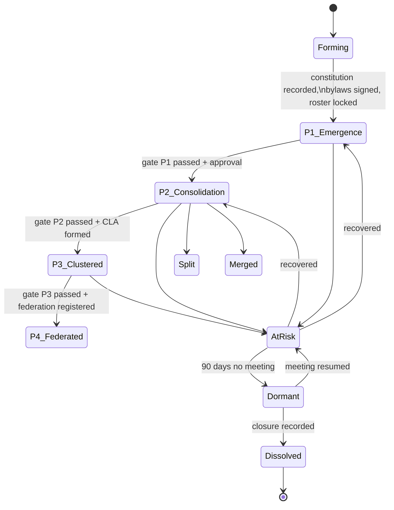

# Section 4 deep dive: Linkage and Graduation

**Two parts:** (1) what is wrong with the phase model as written, benchmarked against the evidence base the handbook itself cites; (2) how to build it as a state machine with defined formulas.

---

# PART 1: PROGRAMME DESIGN CRITIQUE

## 1.1 The timeline is roughly three times too fast

Section 4 compresses SHG maturity into 18 months. The Ethiopian evidence does not support that.

| Source | Maturity threshold used |
|---|---|
| Handbook Section 4 | Federation-ready at 18+ months |
| ODI / Tearfund review of SHG programming by five NGOs in Ethiopia | Tested 3, 4 and 5 year cutoffs. At a 3-year cutoff only 11 of 16 sampled groups counted as mature |
| ODI resilience study of Tearfund SHGs | 5 years set as the maturity threshold, in consultation with the implementer |
| Kindernothilfe SHG manual (the handbook's own cited source) | No preset timeline. "Gradual, organic growth" |

The handbook cites Kindernothilfe for the three-tier structure and then bolts calendar deadlines onto it that Kindernothilfe deliberately avoids. That is the core problem with Section 4: it converts an organic-growth model into a schedule.

**What to do:** keep the phases, drop the month ranges from the definition and move them to a separate "indicative pacing" note. A group advances when it meets the indicators, not when the calendar says so. If FSCO needs planning numbers, present the months as a planning assumption with a stated range, not as part of the phase definition.

## 1.2 Phase 4 is arithmetically unreachable in the pilot

Phase 4 requires "at least 10 CLAs exist, each consisting approximately 8–12 SHGs". That is 80 to 120 SHGs inside one woreda federation.

| Region | Pre-pilot SHGs | Federation feasible? |
|---|---|---|
| Somali | 80 | Only if all 80 sit in one woreda |
| Amhara | 60 | No |
| Afar | 50 | No |
| Central Ethiopia | 45 | No |
| Dire Dawa | 15 | No |

The whole pre-pilot is 250 SHGs across five regions. Phase 4 cannot be tested. Say that explicitly: **the pre-pilot tests Phases 1 to 3 only.** Otherwise the pilot report will be judged against a milestone that was never achievable.

Even at national scale it is tight. Only Somali (835 SHGs) and Amhara (410) could plausibly build multiple woreda federations, and only if SHGs concentrate geographically rather than spreading thin.

## 1.3 Internal contradictions

| # | Contradiction | Detail |
|---|---|---|
| 1 | CLA threshold | Text: "when **8** mature SHGs exist in a kebele". Indicator: "minimum number of SHGs (**around 6**)". Kindernothilfe source: **8 to 10**. Pick one |
| 2 | Federation threshold | Text: "as multiple CLAs form (e.g. **5–10** CLAs)". Indicator: "**at least 10** CLAs exist" |
| 3 | Meeting frequency | Phase 1 indicator: "meeting **every month** on schedule". Section 3.4: "groups should ideally meet **once a week**". A weekly group hitting a monthly indicator is under-measured by a factor of four |
| 4 | Loan gating | Phase 1 (months 0–6) indicator includes "first loans issued and repaid correctly". Section 3.5 bars lending until **10 regular savings meetings**. A monthly-meeting group reaches 6 meetings by month 6. The "(if any)" hedge hides a real conflict |
| 5 | CLA period | Phase 3 indicator requires SHGs with "at least **one year** of regular saving/loans", but Phase 3 opens at **month 12**. So a group formed in month 1 qualifies on day one of the phase and a group formed in month 3 does not. The gate and the phase window are measuring the same thing twice |
| 6 | Credit linkage timing | "Only after 1–2 years should groups be introduced to microfinance or bank loans", citing Ethiopian evidence that early linkage is risky. That same evidence base sets maturity at 3–5 years. The handbook quotes the warning and then sets a threshold below it |

## 1.4 Phase 2's savings target is not a real hurdle

The Phase 2 indicator is: "Group savings fund reaches a target amount (e.g. equivalent to 2–3 months' worth of total member contributions)."

Do the arithmetic. A weekly-meeting group of 20 women reaching month 12 has had roughly 50 saving opportunities. Even at 50% compliance the fund holds about six months of contributions. A group that has only 2–3 months of contributions by month 12 is failing, not graduating.

The target only bites for monthly-meeting groups, and even then it is met by month 3. It is set below the natural accumulation floor, so it screens nothing.

**Replace it with:**

- **Savings compliance rate** (share of expected contributions actually made), because that measures discipline rather than elapsed time
- **A per-member minimum balance**, because a fund can look healthy while three members carry it
- Keep a fund-size figure only for the loan-pool adequacy check, expressed in weeks-of-contribution so it is comparable across groups and regions and does not need re-indexing for inflation

## 1.5 The biggest gap: no share-out rule

Section 4 never says if SHGs **share out** their fund periodically or **accumulate indefinitely**.

This is the largest unstated design decision in the handbook, and it changes everything downstream:

| | Accumulating model (Kindernothilfe SHG, India) | Share-out model (VSLA, CARE) |
|---|---|---|
| Fund | Grows permanently, becomes group capital | Distributed to members at cycle end, usually 9–12 months |
| Graduation means | Federating, formalising, accessing external credit | Completing a cycle and choosing to restart |
| Member incentive | Long-term, patient. Needs strong cohesion | Visible annual payout. Easier to sell, easier to sustain |
| Dropout risk | High if members never see a return | Low, cycle-end resets |
| Ledger design | Continuous, no reset | Cyclical, with a share-out calculation |

The handbook is following the accumulating model without saying so. In PSNP contexts many women have prior exposure to VSLA-style groups and will **expect a share-out**. If they save for two years with no distribution and no clear explanation, expect drop-out in year two, exactly when the indicators say the group is maturing.

**Decide this before build.** The ledger schema differs materially between the two.

## 1.6 There is no failure path

Section 4 is a one-way ratchet. Groups only move up. In practice groups go dormant, split over disputes, lose their treasurer, or dissolve after a shock. The handbook itself notes SHGs lose effectiveness "during widespread covariate shocks", which in Afar and Somali means drought.

Add explicit states: **at risk, dormant, dissolved, split, merged**. Also add a **de-graduation** rule. A Phase 2 group that stops meeting for three months is not a Phase 2 group.

## 1.7 Group graduation and member graduation are not connected

Section 4 graduates *groups*. PSNP's own framing is about *household* graduation from the safety net. Nothing links SHG maturity to a member's PSNP status.

Open questions for FSCO:

- Is SHG membership permanent, or is there an individual exit point?
- Does SHG participation count toward, delay, or have no bearing on PSNP graduation?
- What happens to a member's savings and outstanding loan when she graduates from PSNP, or is removed from the caseload?
- Can non-PSNP women from the same kebele join a mature SHG? (Mature groups usually want to. It is also how the model spreads.)

## 1.8 Savings linkage and credit linkage are being blurred

Phase 2 offers a joint bank account. Phase 4 offers cooperative registration and MFI credit. These carry very different risk.

- **Group savings account:** low risk, safer than a cash box, builds transaction history. Can start early, and arguably should
- **Group credit from an MFI or bank:** high risk, the thing the Ethiopian evidence warns about. Should be late and conditional

Separate them in the text. Right now "linkage" covers both and a facilitator reading quickly will treat them as one step.

## 1.9 Cooperative registration is heavier than one clause suggests

"It may register officially (e.g. as a cooperative)" carries audit obligations, a relationship with the cooperative promotion agency, governance requirements, and tax treatment. It is a real legal entity with real liabilities for the women who sign for it.

Also unaddressed: **RUSACCOs already exist** in rural Ethiopia and are mentioned once in passing. Do WLT federations become RUSACCOs, affiliate with them, or run parallel? Parallel structures compete for the same women's savings and the same woreda staff attention.

## 1.10 Two things Section 4 gets right

Worth saying, because they should survive redrafting:

- **The caution on early MFI linkage is correct** and directly evidence-based. Hold that line under pressure to show financial-inclusion numbers.
- **Two elected representatives per SHG into the CLA** matches the Kindernothilfe design and gives a workable governance ratio. Keep it.

---

# PART 2: APP IMPLEMENTATION SPEC

## 2.1 State machine



Rules:

1. **The system computes readiness. A human approves the transition.** Never auto-graduate.
2. **Every transition writes an immutable evidence snapshot**: the indicator values at the moment of approval, the approver, the timestamp, and any override reason. Later data corrections must not rewrite a past phase decision.
3. **Overrides are allowed and must be reasoned.** Facilitators will need them. An override without a recorded reason should not save.
4. **De-graduation is a normal transition**, not an error state.

## 2.2 Indicator formulas

None of these are defined in the handbook. Do not let developers invent them.

| Indicator | Proposed formula | Notes for FSCO to confirm |
|---|---|---|
| **Meeting adherence** | meetings held / meetings due, rolling 12 due meetings | "Due" comes from the group's own bylaw cadence, not a global default |
| **Attendance rate** | sum(present) / sum(members on roll at each meeting), rolling 12 meetings | Roll changes over time, so use per-meeting roll, not current roll. Decide if absent-with-notice counts differently |
| **Member savings compliance** | meetings where member contributed ≥ bylaw amount / meetings she was expected at, rolling 12 | |
| **Group savings compliance** | share of members with individual compliance ≥ 90% | Better than a group mean, which one strong saver can inflate |
| **Fund adequacy** | total fund / (bylaw contribution × current roll), expressed in **weeks of contribution** | Inflation-proof and comparable across regions |
| **Loan delinquent** | any scheduled repayment ≥ 1 day past due | |
| **Loan in default** | any scheduled repayment ≥ 30 days past due | Standard microfinance convention. Confirm with FSCO |
| **PAR30** | outstanding principal of loans with any payment > 30 days late / total outstanding principal | Standard definition. Do not invent a local variant |
| **Loan cycle completed** | all loans disbursed within a defined window fully repaid, principal and service charge | Needs the window defined. Recommend: from first disbursement to last maturity date within that batch |
| **Dormant** | no meeting recorded for 3 × bylaw cadence, floor 60 days | Weekly group = 60 days. Monthly group = 90 days |
| **At risk** | any of: attendance < 60%, PAR30 > 20%, two consecutive missed meetings, no treasurer on record | Early warning, not a phase demotion |

## 2.3 Phase gates as data

Express every gate as a configurable policy record, not code:

| Gate | Condition set (all must hold) |
|---|---|
| **Forming → P1** | bylaws recorded; ≥ 15 and ≤ 25 members on roll; chair, secretary, treasurer elected; first savings meeting recorded |
| **P1 → P2** | meeting adherence ≥ 90%; attendance ≥ 80% over rolling 12; group savings compliance ≥ 80%; ≥ 10 savings meetings held; if any loans issued, PAR30 = 0 |
| **P2 → P3 eligibility** | fund adequacy ≥ *N* weeks; ≥ 1 loan cycle completed with PAR30 = 0; social fund active; ≥ 52 weeks since P1 entry |
| **P3 formation** | ≥ *M* P2-eligible SHGs in the same kebele; each elects 2 representatives; CLA constitution recorded |
| **P3 → P4** | ≥ *K* CLAs in the woreda, each with ≥ *M* SHGs; CLAs operating ≥ *T* months; federation constitution recorded |

*N, M, K, T* stay as parameters with effective dates and region-level overrides. The handbook says it is a living document and the pilot will course-correct, so **hardcoding 80%, 8 SHGs, or 2–3 months guarantees a code change every time FSCO revises a threshold.** Put them in a policy table with version history, and store which policy version each phase decision was made under.

## 2.4 Data model additions

```
Group
  id, name, kebele_id, formed_date, bylaw_cadence, bylaw_contribution,
  service_charge_basis, service_charge_rate, share_out_model, current_phase,
  status (active|at_risk|dormant|dissolved|split|merged)

GroupMembership          group_id, person_id, joined_date, exited_date, exit_reason
GroupOfficeHolder        group_id, person_id, role, from_date, to_date
Meeting                  group_id, scheduled_date, held_date, recorded_by, closed_at, till_balance
MeetingAttendance        meeting_id, person_id, status
SavingsTransaction       meeting_id, person_id, amount, type (savings|fine|social_fund)
Loan                     group_id, person_id, disbursed_at, principal, charge_rate,
                         purpose, schedule, cycle_batch_id
LoanRepayment            loan_id, meeting_id, principal_paid, charge_paid, due_date

GroupPhaseHistory        group_id, from_phase, to_phase, decided_at, decided_by,
                         policy_version, indicator_snapshot (jsonb), override_reason

CLA                      id, kebele_id, formed_date, constitution_ref, status
CLAMembership            cla_id, group_id, joined_date, exited_date
CLARepresentative        cla_id, group_id, person_id, from_date, to_date
Federation               id, woreda_id, formed_date, legal_status, registration_ref
FederationMembership     federation_id, cla_id, joined_date, exited_date

PolicyParameter          key, scope (global|region|woreda), value,
                         effective_from, effective_to
```

Three things to get right:

- **Membership is dated, not a flag.** Attendance and compliance have to be computed against the roll as it stood, not as it stands now.
- **Office holders rotate.** Who was treasurer on the date of that disbursement is an audit question you will be asked.
- **`indicator_snapshot` is jsonb and immutable.** It is the defence when someone questions a graduation two years later.

## 2.5 Approval workflow

```
System computes gate status (nightly + on meeting close)
   ↓
Group readiness card turns green in facilitator's app
   ↓
Facilitator reviews, adds narrative note, submits
   ↓
Woreda FSCO officer reviews snapshot, approves or returns
   ↓
Phase change written with snapshot + policy version
   ↓
Reporting layer picks up new phase on next refresh
```

For CLA formation the workflow is different: it is a **many-to-one** event across groups in a kebele, needing a formation wizard rather than a per-group approval. Same for federation across CLAs in a woreda.

## 2.6 Screens to add

1. **Group readiness card.** Each gate condition as a traffic light with the actual number next to the threshold. "Attendance 74% (need 80%)" beats a red dot.
2. **Phase timeline.** Horizontal band per group showing time-in-phase, transitions, at-risk episodes. Facilitators use this to spot stalled groups.
3. **Kebele CLA view.** Map or list of SHGs in the kebele with phase status, showing how many more need to reach P2-eligible before a CLA can form. This drives facilitator behaviour more than any report.
4. **CLA formation wizard.** Select eligible SHGs, record two representatives each, capture constitution, generate the CLA record.
5. **Woreda federation register.** Read-mostly, used late.
6. **Cohort dashboard.** Groups by phase by region by formation month. This is the pilot's main learning output.

## 2.7 Reporting definitions to lock before SQL is written

Add these to the reporting schema alongside the existing views:

- `groups_by_phase` (region, woreda, kebele, phase, count, median time-in-phase)
- `phase_transition_events` (with policy version, for auditing mid-pilot rule changes)
- `group_financial_position` (fund, outstanding principal, PAR30, weeks-of-contribution)
- `cla_readiness_by_kebele` (P2-eligible group count vs threshold)
- `at_risk_groups` (reason code, days in state)
- `cohort_survival` (share of groups still active at month N, by formation cohort and region)

`cohort_survival` matters most for the research the handbook commits to. It is the metric that tells you if the model works in Afar the way it works in Amhara.

## 2.8 Build order

| Priority | Item | Why |
|---|---|---|
| P0 | Group, membership, meeting, savings, loan ledger | Nothing in Section 4 computes without these |
| P0 | Policy parameter table | Retrofitting configurability after hardcoding is expensive |
| P1 | Indicator computation + readiness card | The facilitator-facing value |
| P1 | Phase state machine with snapshot | Phases 1 and 2 only for the pre-pilot |
| P2 | CLA entity and formation wizard | Not needed until month 12 of the pilot |
| P3 | Federation | Not reachable in the pre-pilot. Design the schema, defer the UI |

---

## Questions to put to FSCO before build

1. Share-out or accumulate? (Section 1.5. Blocks the ledger schema.)
2. CLA threshold: 6, 8, or 8–10?
3. Federation threshold: 5–10 CLAs or 10+?
4. Weekly or monthly meetings as the pilot default, and does the Phase 1 indicator follow the group's own cadence?
5. Does the 10-meeting lending gate override the Phase 1 loan indicator?
6. Default definition: how many days late?
7. Service charge basis: flat per loan, per month, or declining balance?
8. Does SHG membership relate to PSNP household graduation status at all?
9. Can non-PSNP women join a mature SHG?
10. Confirm the pre-pilot tests Phases 1 to 3 only.

---

## Sources

- [Savings and Self Help Groups in Ethiopia: a review of programming by five NGOs (ODI / Tearfund)](https://learn.tearfund.org/-/media/learn/resources/reports/2016-odi-savings-and-self-help-groups-in-ethiopia-en.pdf)
- [How self-help groups strengthen resilience: a study of Tearfund's approach (ODI)](https://media.odi.org/documents/11625.pdf)
- [Self Help Group Approach manual, Kindernothilfe](https://nafisnetwork.net/wp-content/uploads/2021/02/Self-Help-Group-Approach5827.pdf)
- [Performance Indicators for Microfinance Institutions, technical guide (IADB)](https://www.microfinancelessons.com/files/media_subdomain/resources/tech_guide_iadb_portfolio_quality.pdf)
