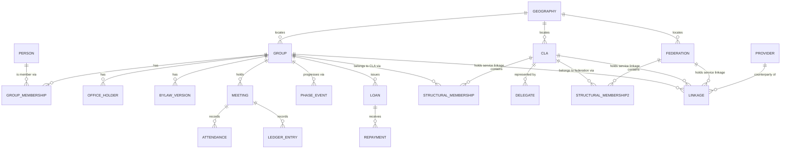
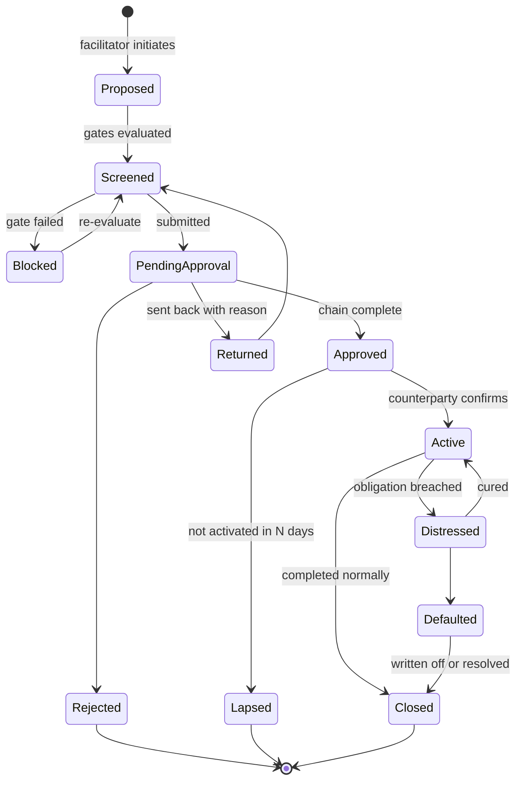

# WLT Group Module: architecture and linkage workflows

**Target stack:** Django + PostgreSQL, alongside the existing youth employment case management core
**Depth:** architecture and workflow. Field-level schema, serializers, and endpoint contracts are left to the build team.
**Source:** Temsalet Pilot Handbook Draft, Sections 3 and 4

> Caveat: `YOUTH_EMPLOYMENT_PLATFORM_DEV_SPEC.md` and the technical specs in this folder are still OneDrive placeholders and could not be read. Where this document names a core-platform capability (identity, geography, RBAC, referral engine, reporting layer) it infers from the dashboard and design handoff artefacts. Verify each named interface against the real spec before build.

---

## 1. Scope

**In scope.** A `wlt` Django app carrying the group domain: SHG formation, membership, meetings, savings and loan ledger, phase progression, CLA and federation structures, and every linkage pathway in Section 4.

**Out of scope.** Changes to the youth case management domain. The core keeps its person-centred case model untouched.

**Non-goals for the pre-pilot.** Member-facing mobile app. Federation UI. Digital payments integration. Automated FSP data exchange.

---

## 2. Module boundary

### 2.1 Why separate

The two domains disagree on the primary subject. The core answers "what is happening to this person". The WLT module answers "what is happening to this group". Forcing group semantics into the case model would mean nullable group columns on `Case`, a referral engine that sometimes points at a person and sometimes at a collective, and a permissions model that cannot express "read this group's ledger but not its members' case files".

A separate app, same database, same auth, shared platform services. Not a separate deployment.

### 2.2 What the module consumes from the core

| Core capability | How the WLT module uses it | Coupling |
|---|---|---|
| **Identity / Person** | A member is a `Person`. The module never creates its own person table | Read + create via core service. Never writes core person fields directly |
| **PSNP client ID** | The join key for eligibility verification and for reconciling with the PSNP MIS | Read-only |
| **Geography hierarchy** | Region → woreda → kebele. Groups, CLAs and federations all anchor to it | Read-only FK |
| **AuthN / user accounts** | WLT facilitators are platform users | Shared |
| **RBAC scoping** | Geographic scoping already built (see `review_kit/fixes/P1-2-rbac-scoping.md`). Extend with group-level object scoping | Extend, do not fork |
| **Referral engine** | Reused for external linkage. See section 4.3, this is the load-bearing decision in this document | Extend to accept a group as subject |
| **Audit log** | Every ledger and phase event | Shared |
| **Reporting layer** | Materialized views, refresh orchestration | Extend with WLT views |
| **Notification / task queue** | Facilitator reminders, approval routing | Shared |
| **Offline sync** | Meeting capture. If the core has no sync layer, this is new platform work, not module work | Shared or new |

### 2.3 What the module owns outright

Group, membership, office holders, meetings, attendance, savings, loans, repayments, social fund, bylaws, phase history, CLA, federation, linkage records, policy parameters.

### 2.4 Direction of dependency

`wlt` depends on `core`. **`core` must not import from `wlt`.** One exception is allowed and should be built deliberately: the referral engine needs to resolve a group subject. Handle that with a registry the core exposes and the module registers into, not with a reverse import.

### 2.5 Django app layout

```
apps/
  core/                  existing: person, geography, rbac, audit, referral
  referrals/             existing: referral engine + timeline (generalise the subject)
  wlt/
    models/              group, membership, meeting, ledger, phase, structure, linkage
    services/            domain logic. no business rules in views or models
      formation.py       group and CLA and federation formation
      ledger.py          savings, loans, repayments, reconciliation
      indicators.py      the formula layer from the Section 4 deep dive
      gates.py           eligibility evaluation against policy parameters
      linkage.py         linkage lifecycle orchestration
    policy/              policy parameter resolution with effective dating
    api/                 DRF viewsets, thin
    sync/                offline reconciliation for meeting capture
    reporting/           WLT materialized views + refresh hooks
```

The service layer is the point. Phase gates, ledger rules and linkage transitions must live in one testable place, because FSCO will change them mid-pilot.

---

## 3. Domain model, entity relationships



Four aggregate roots, each with its own invariants:

| Aggregate | Invariant it protects |
|---|---|
| **Group** | Roster size, one active treasurer at a time, bylaw version in force, phase consistency |
| **Meeting** | Till reconciliation. A meeting cannot close on an unbalanced cash position |
| **Loan** | Outstanding balance, schedule integrity, no repayment before disbursement |
| **Linkage** | State transitions, required approvals, gate satisfaction at approval time |

Three modelling rules that will cause pain if skipped:

1. **Membership, office, and structural membership are all dated ranges, not flags.** Attendance and compliance compute against the roster as it stood on the meeting date.
2. **Bylaws are versioned.** A group changes its contribution amount in month 8. Compliance for months 1 to 7 must still be computed against the old figure.
3. **Policy parameters are effective-dated and scoped.** Thresholds move mid-pilot. Every gate decision records the policy version it was made under.

---

## 4. The linkage domain

This is the core of the ask, so it gets its own model.

### 4.1 Two kinds of linkage, often conflated

Section 4 uses "linkage" for two structurally different things. Modelling them as one entity produces a mess.

| | **Structural linkage** (vertical) | **Service linkage** (external) |
|---|---|---|
| Examples | SHG joins a CLA. CLA joins a federation | Group opens a bank account. Group takes an MFI loan. Group registers as a cooperative. Group signs a buyer agreement. Group accesses an extension service |
| Cardinality | One parent at a time | Many concurrent |
| Exclusivity | Exclusive | Non-exclusive |
| Carries | Governance, delegates, voting | Obligations, money, contract terms |
| Created by | A formation event across many groups | A per-entity application |
| Ends by | Withdrawal, dissolution, merge | Closure, maturity, default, termination |
| Reversibility | Rare and significant | Routine |

Model them separately. `StructuralMembership` and `Linkage`.

### 4.2 Structural linkage

```
StructuralMembership
  parent_type      cla | federation
  parent_id
  child_type       group | cla
  child_id
  joined_on, exited_on, exit_reason
  formation_event_id     the multi-party event that created it
```

Constraint: a child holds at most one open structural membership at a time. Enforce with a partial unique index on `(child_type, child_id) WHERE exited_on IS NULL`.

`Delegate` sits alongside, holding the two representatives each SHG elects into its CLA, dated, with a rotation history.

### 4.3 Service linkage rides the existing referral engine

**This is the load-bearing recommendation.** Your platform already has a referral engine with a stack timeline component (`REFERRAL_STACK_TIMELINE_COMPONENT_PROMPT.md`, and the rendering fix). A service linkage is structurally identical to a referral:

- a subject is connected to an external provider
- there is a lifecycle from initiated to accepted to active to closed
- there are dated events with actors and notes
- the field worker wants a timeline view of everything a subject has been connected to

The only difference is the subject type. A referral points at a person. A linkage points at a group, a CLA, or a federation.

**Generalise the referral subject to a polymorphic reference and reuse the whole stack.** You get the timeline UI, the event model, the provider directory, and the reporting for free. Building a parallel linkage system beside an existing referral system is duplicated logic that will drift.

If the core referral model cannot be generalised without destabilising the youth side, the fallback is a `Linkage` model in `wlt` that mirrors the referral event shape exactly, plus a shared timeline component reading from both. Worse, but survivable.

### 4.4 Linkage taxonomy

Six linkage types, each with different gates and approval chains. Type is data, not a class hierarchy.

| Type | Subject | Earliest phase | Risk | Approval chain |
|---|---|---|---|---|
| `savings_account` | Group | P2 | Low | Facilitator → Woreda |
| `cooperative_membership` | Group, CLA | P3 | Medium | Facilitator → Woreda → Cooperative Promotion Office |
| `credit_facility` | CLA, Federation | P4 | **High** | Facilitator → Woreda → Region → FSCO federal |
| `market_offtake` | Group, CLA, Federation | P2 | Medium | Facilitator → Woreda |
| `service_referral` | Group, Person | Any | Low | Facilitator |
| `cooperative_registration` | Federation | P4 | High | Region → FSCO federal → legal review |

Two things to note. `credit_facility` is the pathway the Ethiopian evidence warns about, so it carries the longest approval chain deliberately. And `service_referral` at any phase is where the module reconnects to the core's existing referral use cases, including the individual-level referrals a facilitator might make for a member.

### 4.5 Provider directory

Linkages need a counterparty. Extend or reuse the core's provider or service directory:

```
Provider
  name, type (bank | mfi | rusacco | cooperative | buyer | govt_service | ngo)
  geography_scope        which woredas it actually operates in
  products               offered terms, indicative
  status                 active | suspended | blacklisted
  contact, agreement_ref
```

Two field realities to build for. First, a provider present in Amhara is often absent in Afar, so `geography_scope` must filter what a facilitator can even propose. Second, RUSACCOs are the incumbent rural structure and should be first-class in the directory, not lumped under "other". Section 1.9 of the Section 4 review flags the unresolved question of if WLT federations compete with or join RUSACCOs. The directory is where that decision becomes visible in the data.

### 4.6 Linkage lifecycle

One state machine for all service linkage types. Types vary by gate and approval chain, not by lifecycle.



Rules:

1. **Gates are evaluated at screening and re-evaluated at approval.** A group can drift below threshold while an approval sits in a queue. Approving against stale numbers is how bad credit linkages happen.
2. **Every transition writes an immutable evidence snapshot**: indicator values, policy version, actor, timestamp.
3. **`Blocked` is a first-class state, not an error.** It tells the facilitator exactly what the group needs to reach. This is the single most behaviour-changing screen in the module.
4. **Overrides need a reason and escalate the approval chain by one level.** No silent overrides on `credit_facility`.
5. **`Distressed` and `Defaulted` feed back into the group's own at-risk state.** A group with a defaulted external facility should not be showing green on its phase card.

---

## 5. Linkage workflows in detail

### W1. CLA formation

The hardest workflow in the module, because it is a many-to-one event rather than a per-record action.

**Trigger.** Facilitator opens the kebele CLA readiness view and sees enough eligible SHGs.
**Actors.** WLT facilitator (initiates), SHG members (elect), woreda FSCO (approves).
**Preconditions.** *M* SHGs in the same kebele at P2-eligible or above. *M* is a policy parameter, currently disputed in the handbook between 6 and 8.

| Step | Actor | System behaviour |
|---|---|---|
| 1 | Facilitator | Opens kebele readiness view. Sees eligible / near-eligible / ineligible SHGs with the gap for each |
| 2 | Facilitator | Starts a **formation event**. Selects candidate SHGs. System re-evaluates each and blocks selection of ineligible ones with the reason shown |
| 3 | Each SHG | At its own meeting, elects two delegates. Recorded against that meeting, not against the formation event, so the audit trail sits with the group |
| 4 | System | Formation event stays open until every selected SHG has recorded two delegates. Shows outstanding groups |
| 5 | Facilitator | Records CLA constitution, name, meeting cadence, first meeting date |
| 6 | Facilitator | Submits formation event |
| 7 | Woreda FSCO | Reviews the snapshot: which groups, their indicators at submission, delegates, constitution. Approves or returns |
| 8 | System | On approval, creates `CLA`, opens `StructuralMembership` for each SHG, activates `Delegate` records, moves each SHG to P3, writes phase events with the shared formation event id |

**Failure paths.**

- A selected SHG drops below threshold before approval. System flags it at approval time. Woreda either returns the event or approves with the group excluded, which needs an explicit exclusion action so the group's own record shows why.
- An SHG withdraws mid-formation. Event stays open. If the remaining count falls below *M*, the event is blocked, not deleted.
- Formation events expire. Recommend 90 days, configurable. Prevents zombie events.

**Data written.** `FormationEvent`, `CLA`, `StructuralMembership` per group, `Delegate` per representative, `PhaseEvent` per group, audit entries.

**Offline.** Delegate election is captured offline as part of a meeting. Formation submission and approval are online-only. Design the facilitator app so partial offline progress is visible but the event cannot be submitted without sync.

### W2. Delegate rotation

Small workflow, easy to forget, causes audit problems if missed.

Delegates rotate on the SHG's own bylaw cycle. Facilitator records the new pair at a group meeting. System closes the previous `Delegate` rows and opens new ones. **Never edit in place**, because "who represented this group at the CLA meeting that approved the loan" is a question that gets asked.

Alert the facilitator when a delegate has served past the bylaw rotation period.

### W3. Federation formation

Same shape as W1, one level up. Subjects are CLAs, geography is woreda, approval chain runs to region.

**Not reachable in the pre-pilot.** Phase 4 needs 80 to 120 SHGs in one woreda and the largest regional allocation is 80 across a whole region. Build the schema, defer the UI. Section 1.2 of the Section 4 review has the arithmetic.

Additional step W1 does not have: **legal entity registration.** Federation formation may produce a registered cooperative, which brings audit obligations, a cooperative promotion agency relationship, and named signatories carrying real liability. Model registration as a separate `Linkage` of type `cooperative_registration`, not as an attribute of the federation. It has its own lifecycle, can fail, and can lapse.

### W4. Group savings account

The low-risk linkage, and the one that should happen early and often.

**Trigger.** Phase 2 group, facilitator or the group itself proposes.
**Gates.** Group at P2. Chair, secretary and treasurer on record. Bylaw covering account signatories recorded.

Steps: propose → screen → woreda approval → facilitator supports the group through bank onboarding → counterparty confirms → `Active`, with account reference stored.

**Important:** activating a savings account changes ledger behaviour. The cashbook already has cash and bank columns (Annex 2). Once an account is `Active`, the meeting close reconciliation must handle two balances, and deposits become a distinct transaction type with a lag between meeting collection and bank deposit. Build that into the ledger service before enabling this linkage, not after.

**Do not gate this behind Phase 3.** A locked cash box in a pastoralist kebele is a worse custodian than a bank account. The Section 4 review makes this argument at 1.8: savings linkage and credit linkage carry very different risk and the handbook blurs them.

### W5. Credit facility

The high-risk pathway. Build the friction in deliberately.

**Subject.** CLA or federation. **Recommend blocking group-level credit facilities entirely in the pilot.** The evidence on early MFI linkage to savings groups is the clearest finding in the Ethiopian literature.

**Gates, all required.**

| Gate | Rationale |
|---|---|
| Subject at P4, or P3 with region-level override | Follows the handbook's own caution |
| Aggregate PAR30 across member SHGs = 0 for the trailing 6 months | Internal discipline before external debt |
| ≥ 2 completed internal loan cycles per member SHG | Track record, not elapsed time |
| Active `savings_account` linkage ≥ 12 months | The transaction history the handbook says builds creditworthiness |
| Facility size ≤ *X* × aggregate own funds | Caps leverage. *X* is a policy parameter. Recommend starting at 1.0 |
| Provider is `active` in the directory and operates in that woreda | Stops proposals against providers with no local presence |

**Approval chain.** Facilitator → Woreda → Region → FSCO federal. Four levels is intentional. Each level sees the same evidence snapshot, re-evaluated at each hop.

**Post-activation obligations.** A credit facility creates a repayment schedule the module must track. Missed obligation moves the linkage to `Distressed`, marks the subject at-risk, and blocks any new linkage proposal for that subject until cured. Cascade the at-risk flag down to member SHGs, because a federation default is their exposure too.

**Terms capture.** Record rate, basis, tenor, collateral or guarantee arrangement, and signatories at approval. Group guarantee is the usual arrangement and the guaranteeing members must be named and dated.

### W6. Market and value chain linkage

Lower ceremony, higher volume. Recommended as the **second** linkage type to build after savings accounts, because it produces visible income benefit early and does not carry debt risk.

Subject group, CLA or federation. Provider is a buyer, aggregator or processor. Gate on phase only, plus a check that the subject has a recorded production or IGA profile.

Steps: propose → woreda screen → agreement terms recorded → `Active` → periodic delivery and payment events logged against the linkage → `Closed` at agreement end.

The delivery and payment events are what make this linkage useful for M&E. Without them it is a name in a field.

### W7. Service referral

The thinnest workflow, and the direct reuse of the existing referral engine. A facilitator connects a group or an individual member to a government or NGO service: extension, health, legal aid, literacy.

No gates beyond an active subject. Facilitator-level approval. Uses the existing referral timeline UI unchanged once the subject is polymorphic.

**One safeguarding rule.** Section 3.6 of the handbook puts GBV on the meeting agenda. If a GBV referral pathway is ever added, it must be an individual-subject referral in a restricted store with its own consent flow, never a group-subject linkage, and never visible on the group timeline. Build the subject-type restriction into the referral type definition so it cannot be created wrongly.

### W8. De-linkage and exit

Every linkage needs a closure path, and closure is where data goes bad if unplanned.

| Scenario | Handling |
|---|---|
| SHG withdraws from a CLA | Close `StructuralMembership` with reason. Close delegate rows. Demote to P2. Recompute the CLA's member count. **If the CLA falls below *M*, flag it, do not auto-dissolve.** A human decides |
| CLA dissolves | Cascade: close all child memberships, demote all member SHGs, close CLA-level service linkages, escalate any active credit facility for resolution |
| Group splits | Two new groups, both inheriting a share of the ledger. **This needs an explicit split service** that allocates member balances and outstanding loans, because doing it by hand corrupts the ledger. Original group moves to `Split`, not `Dissolved` |
| Group merges | Reverse operation, equally deliberate |
| Group dissolves with an active loan | Block dissolution. Force a resolution path first: repayment, write-off with approval, or transfer of obligation |
| Provider blacklisted | All `Active` linkages to it flagged for review. Do not auto-close, because the obligation still exists |

Splits and dissolutions with outstanding money are the workflows most likely to be skipped in build and most likely to be needed in Afar and Somali, where shocks scatter groups.

---

## 6. Eligibility and gate evaluation

One service, `gates.py`, evaluates every gate in the module: phase transitions and linkage screening both.

```
evaluate(subject, gate_set, as_of) -> GateResult
  GateResult: passed | blocked
              per-condition: threshold, actual, met
              policy_version
              computed_at
```

Design points:

- **Always return the actual value next to the threshold.** "Attendance 74%, need 80%" drives behaviour. A red dot does not.
- **Compute nightly and on write.** Nightly for dashboards, on write so a facilitator closing a meeting sees the readiness card change immediately. That immediate feedback is most of the module's behaviour-change value.
- **Snapshot on every decision.** Serialise the whole `GateResult` into the phase or linkage event. It is the audit defence.
- **Thresholds resolve through the policy layer** with geography scope and effective dates, never from constants.

---

## 7. Permissions

Extend the existing geographic RBAC with object-level rules. Two dimensions: geographic scope and role capability.

| Capability | Facilitator | Woreda FSCO | Region | Federal / WB |
|---|---|---|---|---|
| Create group, record meetings, ledger entries | Own groups | No | No | No |
| View group ledger | Own groups | Woreda | Region | Aggregate only |
| Submit phase transition | Own groups | No | No | No |
| Approve phase transition | No | Woreda | Region | No |
| Initiate `savings_account`, `market_offtake`, `service_referral` | Own groups | Yes | Yes | No |
| Approve those | No | Yes | Yes | No |
| Initiate `credit_facility` | Own subjects | Yes | Yes | No |
| Approve `credit_facility` | No | Level 1 | Level 2 | Level 3 |
| Override a blocked gate | No | With reason, escalates | With reason | Yes |
| Manage provider directory | No | Propose | Approve | Approve |
| Manage policy parameters | No | No | Propose | Approve |

Two rules worth stating explicitly:

1. **No self-approval.** The submitter cannot be the approver at any level, even where roles overlap in a thin woreda office.
2. **Member case files are not visible through the group.** A facilitator seeing a group roster should not gain access to those members' youth-side case records. This is the permissions failure most likely to slip through, because the join is easy to write.

---

## 8. Offline behaviour

| Operation | Offline? |
|---|---|
| Record meeting, attendance, savings, repayments | **Yes.** The core requirement |
| Disburse a loan | Yes, with local balance validation |
| View readiness card | Yes, from last sync, clearly stamped with sync time |
| Propose a linkage | Queue offline, submit on sync |
| Approve anything | **No.** Online only |
| Formation events | Delegate capture offline, submission online |

Conflict policy: meetings are append-only per group and per date, so genuine conflicts are rare. Where two devices record the same meeting, keep both, flag for facilitator resolution, and never auto-merge financial records. A stale readiness card that is honest about its age is better than a fresh one that is wrong.

---

## 9. Reporting additions

Extend the existing materialized view set rather than building a parallel reporting layer:

- `wlt_groups_by_phase` (geography, phase, count, median time in phase)
- `wlt_phase_events` (with policy version, for auditing mid-pilot rule changes)
- `wlt_group_financials` (fund, outstanding principal, PAR30, weeks of contribution)
- `wlt_cla_readiness` (eligible group count vs threshold, per kebele)
- `wlt_linkages_active` (type, provider, subject, value, days active)
- `wlt_linkage_funnel` (proposed → screened → approved → active → closed, with block reasons)
- `wlt_at_risk` (subject, reason code, days in state)
- `wlt_cohort_survival` (share of groups active at month N, by formation cohort and region)

`wlt_linkage_funnel` block reasons are the highest-value output for programme learning. It tells FSCO which gate is stopping groups, which is the evidence for adjusting a threshold rather than guessing.

---

## 10. Build sequence

| Stage | Contents | Gate to next stage |
|---|---|---|
| **0. Platform prep** | Generalise referral subject to polymorphic. Extend RBAC for object scoping. Confirm or build offline sync | Youth-side regression suite green |
| **1. Group core** | Group, membership, office holders, bylaws, meetings, attendance, savings ledger, till reconciliation | Reconciliation holds against seeded fixtures |
| **2. Policy + indicators** | Policy parameter layer, indicator formulas, readiness card | Formulas match hand calculation on fixtures |
| **3. Lending** | Loans, repayments, service charge engine, PAR30, cycles | Ledger balances across a full simulated cycle |
| **4. Phase machine** | P1 and P2 gates, submission, approval, snapshots, at-risk and dormant states | Full transition audit trail reproducible |
| **5. Linkage: low risk** | Lifecycle engine, provider directory, `savings_account`, `market_offtake`, `service_referral` | Funnel reporting works end to end |
| **6. CLA** | Formation events, delegates, structural membership, P3 | Formation event handles the failure paths in W1 |
| **7. Linkage: high risk** | `credit_facility`, multi-level approval, obligation tracking, distress cascade | Not needed for the pre-pilot |
| **8. Federation** | Schema and minimal admin only | Deferred |

Stages 0 to 5 are the pre-pilot. Stage 6 lands around month 12 of the pilot. Stages 7 and 8 are post-pilot.

---

## 11. Decisions needed before stage 1

These block the schema, not just the build.

1. **Share-out or accumulate.** Still the largest open question. Determines if the ledger has cycles.
2. **Can the core referral model take a polymorphic subject?** If no, the fallback in 4.3 applies and the estimate grows.
3. **Does the core have an offline sync layer?** If no, that is platform work on the critical path, not module work.
4. **Service charge basis:** flat per loan, per month, or declining balance.
5. **Default definition:** days past due.
6. **CLA threshold:** 6, 8, or 8 to 10.
7. **Group-level credit facilities:** blocked in the pilot, or allowed with region override.
8. **RUSACCO relationship:** WLT federations become RUSACCOs, affiliate, or run parallel.
9. **PSNP client ID availability.** Without it there is no eligibility verification and no reconciliation with the PSNP MIS.
10. **Confirm the pre-pilot covers Phases 1 to 3 only.**

---

## Sources

- [Savings and Self Help Groups in Ethiopia: a review of programming by five NGOs (ODI / Tearfund)](https://learn.tearfund.org/-/media/learn/resources/reports/2016-odi-savings-and-self-help-groups-in-ethiopia-en.pdf)
- [How self-help groups strengthen resilience (ODI)](https://media.odi.org/documents/11625.pdf)
- [Self Help Group Approach manual, Kindernothilfe](https://nafisnetwork.net/wp-content/uploads/2021/02/Self-Help-Group-Approach5827.pdf)
- [Learning from a savings group digitisation pilot in Uganda, Response Innovation Lab](https://www.responseinnovationlab.com/updates/learning-from-a-savings-group-digitisation-pilot-in-uganda)
- [Performance Indicators for Microfinance Institutions, technical guide (IADB)](https://www.microfinancelessons.com/files/media_subdomain/resources/tech_guide_iadb_portfolio_quality.pdf)
