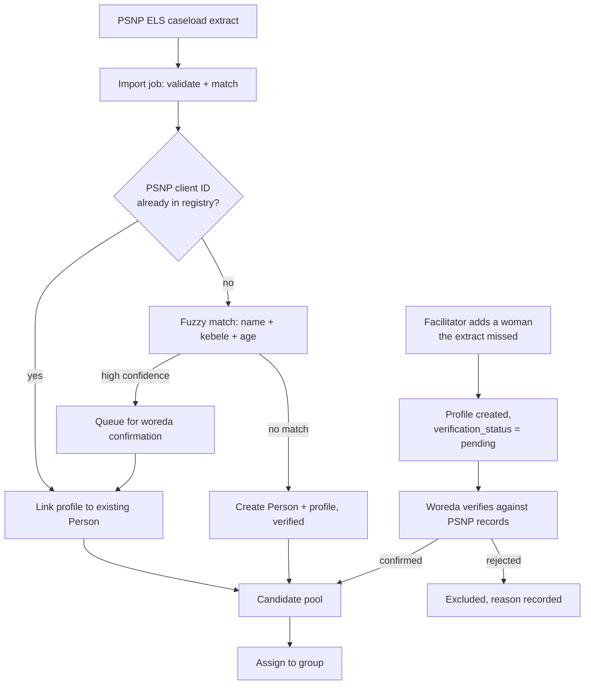
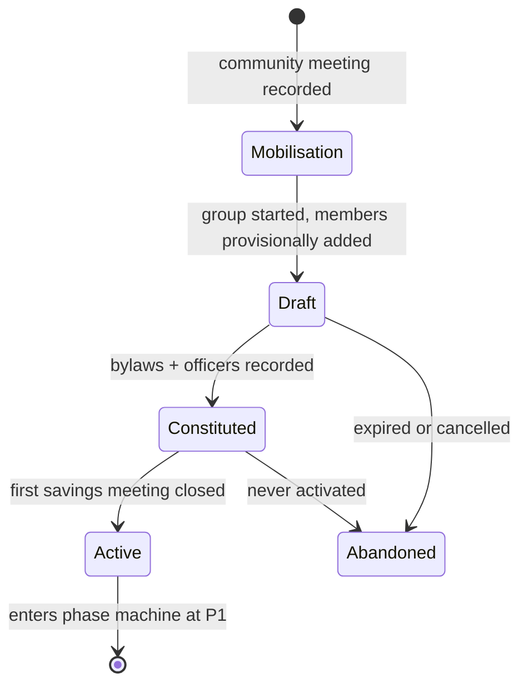

# WLT module build spec v2: registry, group formation, linkage

**Supersedes** the relevant sections of `WLT_Group_Module_Architecture_and_Linkage_Workflows.md`. Everything not restated here still stands.

**Decisions locked this round:**

| # | Decision | Consequence |
|---|---|---|
| D1 | Registry stays as is. People register as individuals, then join groups | No parallel person table. Group membership is a join, not an identity |
| D2 | Group formation is new functionality on top of the existing registry | New `wlt` formation flow, no change to core registration |
| D3 | Linkage splits into **structural** and **service** | Two models, two lifecycles, two UIs |
| D4 | Service linkage rides the existing referral engine | Platform change: referral subject becomes polymorphic |
| D5 | Enrolment is hybrid: import the PSNP ELS caseload, facilitators add exceptions | Import pipeline + exception verification workflow |

---

## 1. Registry: what stays, what extends

### 1.1 Person stays untouched

`core.Person` is the single identity. A WLT member is a Person with a WLT profile and one or more group memberships. No `WltMember` table. This is the right call and it means the youth side and the WLT side can never disagree about who someone is.

### 1.2 What the youth registration form will not capture

The existing registry was built for youth employment. WLT needs fields it almost certainly does not have. Put them in an extension, not on `Person`:

```
wlt.BeneficiaryProfile          one-to-one with core.Person
  psnp_client_id                the join key to the PSNP MIS
  psnp_woreda, psnp_kebele      as recorded in PSNP, may differ from current residence
  els_completed_on              life skills, financial literacy, MED
  els_grant_received_on
  els_grant_amount
  primary_iga                   for group homogeneity matching
  literacy_level                none | basic | functional
  has_device                    handbook 3.3 criterion
  digital_literacy              none | basic
  household_head                bool
  enrolment_route               import | facilitator
  verification_status           verified | pending | rejected
  verified_by, verified_on
```

`literacy_level`, `has_device` and `digital_literacy` exist because handbook section 3.3 makes them selection criteria. If they are not captured they cannot be used to compose groups, and the "at least one member with a device" rule becomes unenforceable.

Keep `Person` clean. Nothing WLT-specific goes on it.

### 1.3 Eligibility

Two layers, and they should not be conflated.

**Programme eligibility** (can she join WLT at all): female, active PSNP livelihoods beneficiary, ELS package completed, grant received. Computed from `BeneficiaryProfile`, cached, recomputed on profile change.

**Group fit** (should she join *this* group): same or adjacent kebele, similar socio-economic status, no active conflict with existing members, willing to commit. These are facilitator judgements, not system rules. Surface them as prompts in the assignment flow, never as hard blocks. The handbook is explicit that participation is voluntary and members are not pressured into a particular group. A system that auto-assigns would break that principle.

### 1.4 Hybrid enrolment pipeline



Rules that matter:

1. **PSNP client ID is the primary key for matching.** Where it is missing from the extract, that record needs manual resolution, not a guess.
2. **Never auto-merge on a fuzzy match.** Queue it. Merging two different women is worse than a duplicate.
3. **Facilitator-added exceptions start as `pending`** and cannot be assigned to a group until a woreda officer verifies. This is the control that stops the exception path becoming the main path.
4. **Duplicate detection runs on assignment, not just on import.** The realistic failure is the same woman entering through both routes in the same week.

### 1.5 Enforce the allocation ceiling

The pre-pilot has a hard 5,000 ceiling with regional allocations. Build this in, because it will otherwise be discovered in a spreadsheet three months late.

| Region | Allocation | SHGs |
|---|---|---|
| Somali | 1,600 | 80 |
| Amhara | 1,200 | 60 |
| Afar | 1,000 | 50 |
| Central Ethiopia | 908 | 45 |
| Dire Dawa | 292 | 15 |

Model as `EnrolmentAllocation` (geography, target, ceiling, effective dates). Warn the facilitator at 90% of a region's allocation. Block group activation past the ceiling unless a region-level override is recorded with a reason. The allocations are policy parameters, not constants, because FSCO will move them.

### 1.6 The permissions trap, restated

A person can hold a youth case **and** a WLT membership. A WLT facilitator with access to a group roster must not thereby gain access to those women's youth-side case records, and a youth case worker must not see WLT ledger data. Scope by module capability, not by person access. This is easy to get wrong because the join is one line of ORM.

---

## 2. Group formation workflow

This is the new functionality D2 asks for. It maps handbook section 3.4 onto a state machine.

### 2.1 States



A group is not real until it has saved money. `Active` is the moment the phase machine takes over and P1 begins.

### 2.2 Steps

| Step | Handbook ref | Actor | System behaviour | Offline |
|---|---|---|---|---|
| **1. Community meeting** | 3.4 step 1 | Facilitator | Record a `MobilisationEvent`: kebele, date, attendee counts by category (potential members, husbands, elders, leaders), endorsement obtained yes/no, notes. No individual names beyond the facilitator | Yes |
| **2. Members-only meeting** | 3.4 step 2 | Facilitator | Open a group `Draft`. Pull the candidate pool for that kebele: eligible, verified, unassigned. Facilitator selects members. Fit prompts shown, not enforced | Yes |
| **3. Roster validation** | 3.3, 3.4 | System | Soft warnings: size outside 15 to 25, no member with basic literacy, no member with a device, mixed kebele. All overridable with a reason. Hard blocks: unverified profile, already in an active group, not programme-eligible | Yes |
| **4. Bylaws** | 3.4 step 3 | Facilitator | Capture `BylawVersion` v1: meeting cadence and day, contribution amount, loan procedure, service charge basis and rate, penalties, officer rotation period, quorum. Free-text clauses in local language stored alongside | Yes |
| **5. Officer election** | 3.4 step 4 | Members | Record chair, secretary, treasurer as `OfficeHolder` rows with a term start. Rotation period comes from the bylaws | Yes |
| **6. Constitution** | 3.4 | Facilitator | Group moves to `Constituted`. Roster locks. Further changes go through the membership change flow, not by editing the draft | Yes |
| **7. Bookkeeper training** | 3.4 step 5 | Facilitator | Record a training event against the group and named members. This is a Phase 1 evidence item, so it needs to be data, not a note | Yes |
| **8. First savings meeting** | 3.4 step 6 | Facilitator | Normal meeting flow. On close with a balanced till, group moves to `Active` and P1 starts | Yes |

Everything in formation works offline. That is deliberate. Formation happens in a kebele, not in an office.

### 2.3 Validation: hard blocks vs soft warnings

Getting this split wrong is the most likely way to make the module unusable in the field.

**Hard blocks** (cannot proceed):

- Member not programme-eligible
- Member `verification_status` is `pending` or `rejected`
- Member already in an `Active` group
- Fewer than 15 members at constitution
- No treasurer recorded

**Soft warnings** (proceed with a recorded reason):

- Roster above 25 or below 20
- No member with basic literacy
- No member with a device or digital literacy
- Members drawn from more than one kebele
- Regional allocation above 90%

The handbook's group size is stated three different ways (15 to 20, 15 to 25, and 20 in the target arithmetic). Until FSCO closes that, put both bounds in the policy layer and treat the outer range as the hard block.

### 2.4 Failure paths

| Scenario | Handling |
|---|---|
| Draft never constituted | Expire after 60 days, configurable. Members return to the candidate pool. Do not delete, keep the abandoned draft for learning |
| Woman appears in two drafts | Second draft blocks at selection with a pointer to the first. Whichever constitutes first wins |
| Group constituted but never holds a savings meeting | Expire after 30 days from constitution. This is a real pattern and it should show in reporting, because a kebele with three abandoned constitutions is a mobilisation problem |
| Member leaves before activation | Edit the draft freely. After constitution, use the membership change flow |
| Community endorsement refused | Record it against the `MobilisationEvent` and close it. This is programme-critical learning for the pilot and it is invisible if only successes are recorded |

That last row matters. If the system only records groups that formed, the pilot cannot answer why some kebeles produced none.

### 2.5 Membership changes after activation

Dated, reasoned, never destructive:

- **Join:** eligible, verified, not in another active group. Recompute roster size against bylaws. Her savings compliance starts from her join date, not the group's formation date.
- **Exit:** reason code (moved, married out, died, withdrew, expelled, PSNP caseload exit). **Block exit while she has an outstanding loan** until settled, written off with approval, or transferred.
- **Constraint:** one open membership per person at a time. Partial unique index on `(person_id) WHERE exited_on IS NULL`.

All indicator formulas compute against the roster as it stood on each meeting date. This is why membership is a dated range and not a flag.

---

## 3. Structural linkage, confirmed

```
wlt.StructuralMembership
  parent_type       cla | federation
  parent_id
  child_type        group | cla
  child_id
  joined_on, exited_on, exit_reason
  formation_event_id
```

- Partial unique index on `(child_type, child_id) WHERE exited_on IS NULL`. One parent at a time.
- Created only by a `FormationEvent`, never by direct write. The multi-party workflow is the only legal path.
- `wlt.Delegate` holds the two representatives each SHG elects into its CLA, dated, with rotation history.

CLA and federation formation workflows are unchanged from W1 and W3 in the previous document.

---

## 4. Referral engine generalisation

This is the platform change D4 requires, and the riskiest item in the plan because it touches working youth-side code.

### 4.1 Target shape

The referral subject becomes polymorphic across `Person`, `Group`, `CLA`, `Federation`.

**Recommended pattern: typed nullable FK columns plus a check constraint.** Not Django's `GenericForeignKey`.

```
referrals.Referral
  subject_person_id       FK core.person       nullable
  subject_group_id        FK wlt.group         nullable
  subject_cla_id          FK wlt.cla           nullable
  subject_federation_id   FK wlt.federation    nullable
  subject_type            generated column, derived from which is set

  CHECK (num_nonnulls(subject_person_id, subject_group_id,
                      subject_cla_id, subject_federation_id) = 1)
```

Why not `GenericForeignKey`:

- Your reporting layer is built on materialized views. A GFK cannot be joined in SQL without a contenttypes lookup per row, so every WLT reporting view would degrade or need hand-written unnesting.
- GFK gives no referential integrity. A deleted group leaves dangling referrals.
- Typed columns index cleanly and read obviously in the SQL your team already maintains.

The cost is one column per subject type. With four types that is acceptable. If subject types were open-ended it would not be.

A thin Python resolver gives the model a single `subject` property so application code does not branch.

### 4.2 Migration, zero downtime

| Stage | Action | Rollback |
|---|---|---|
| 1 | Add the four nullable columns and the generated `subject_type`. No constraint yet | Drop columns |
| 2 | Backfill `subject_person_id` from the existing `person_id` | Truncate the new column |
| 3 | Dual-write both old and new columns in application code | Stop dual-write |
| 4 | Verify parity across the full table. Row counts and spot checks | Continue dual-write |
| 5 | Switch reads to the new columns. Add the check constraint `NOT VALID`, then `VALIDATE` | Switch reads back |
| 6 | Update the timeline component to resolve subject by type | Revert component |
| 7 | Update reporting views | Revert views |
| 8 | Drop `person_id` after a full release cycle with no issues | Keep it |

Do not compress stages 5 to 8 into one release. The youth side is live work and a bad referral migration is visible to case workers immediately.

### 4.3 What else changes

| Component | Change | Risk |
|---|---|---|
| Referral timeline (`REFERRAL_STACK_TIMELINE_COMPONENT_PROMPT.md`) | Resolve subject by type. Render a group header where the subject is a group | **Medium.** You already fixed a rendering bug here once. Regression test the youth path explicitly |
| Referral type definitions | Add `allowed_subject_types` per type. This is what stops a GBV referral being created against a group | Low, and it closes a safeguarding hole |
| Permissions | Referral visibility now resolves through two different scoping paths, person-scoped and group-scoped | **High.** This is where a leak between modules would appear. Test both directions |
| Provider directory | Add `geography_scope`, and RUSACCO as a first-class provider type | Low |
| Reporting views | Every referral view needs a subject-type dimension | Medium |

### 4.4 The safeguarding rule, now enforceable

With `allowed_subject_types` on the referral type, the rule from section 3.6 of the handbook becomes a constraint rather than a convention: a GBV or protection referral type permits `person` only, never `group`, and lives in a restricted store outside the group timeline. Build this in stage 0, not later.

---

## 5. Revised build sequence

| Stage | Contents | Notes |
|---|---|---|
| **0. Platform prep** | Referral subject generalisation (4.2 stages 1 to 8). `allowed_subject_types`. RBAC object scoping. Offline sync confirmed or built | Critical path. Everything else waits on the sync answer |
| **1. Registry extension** | `BeneficiaryProfile`, eligibility computation, import pipeline, fuzzy match queue, facilitator exception + woreda verification, allocation ceilings, candidate pool view | New this round, driven by D5 |
| **2. Group formation** | Mobilisation events, draft, roster validation, bylaws v1, officers, constitution, activation. Membership change flow | New this round, driven by D2 |
| **3. Meetings and savings** | Meeting capture, attendance, savings ledger, till reconciliation | Unchanged |
| **4. Policy and indicators** | Policy parameter layer, formulas, readiness card | Unchanged |
| **5. Lending** | Loans, repayments, service charge engine, PAR30, cycles | Unchanged |
| **6. Phase machine** | P1 and P2 gates, submission, approval, snapshots, at-risk, dormant | Unchanged |
| **7. Service linkage** | Lifecycle on the generalised referral engine. `savings_account`, `market_offtake`, `service_referral` | Cheaper now that stage 0 did the work |
| **8. Structural linkage** | Formation events, delegates, CLA, P3 | Around month 12 of the pilot |
| **9. Credit and federation** | `credit_facility`, multi-level approval, obligation tracking. Federation schema | Post-pilot |

Stages 0 to 7 are the pre-pilot. The registry and formation work at stages 1 and 2 is new scope that did not exist in the previous sequence, so the pre-pilot estimate goes up.

---

## 6. What I would still push back on

**The hybrid enrolment route needs a hard control or it becomes the default path.** Facilitators under pressure to fill groups will add women rather than wait for an extract. Two safeguards: the `pending` state blocks group assignment, and the share of members enrolled by the exception route should be a reported metric per woreda. If it climbs past 10%, the extract is the problem and should be fixed rather than worked around.

**Stage 0 is real work and it is on the critical path.** The referral generalisation touches live youth-side code, and the permissions rework is the highest-risk item in the whole plan. Do not let it be estimated as a small refactor because it sounds like plumbing.

**Three decisions from the last document are still open and still block schema:** share-out or accumulate, service charge basis, and default definition in days past due. The first one blocks the ledger design at stage 3.

**One question the decisions raise:** can a woman belong to a WLT group and also hold an active youth employment case? If yes, that is fine and the permissions split handles it. If FSCO considers them mutually exclusive, that is an eligibility rule and needs stating now, because it changes the candidate pool query.

---

## Sources

- [Savings and Self Help Groups in Ethiopia, ODI / Tearfund](https://learn.tearfund.org/-/media/learn/resources/reports/2016-odi-savings-and-self-help-groups-in-ethiopia-en.pdf)
- [Self Help Group Approach manual, Kindernothilfe](https://nafisnetwork.net/wp-content/uploads/2021/02/Self-Help-Group-Approach5827.pdf)
- [Learning from a savings group digitisation pilot in Uganda, Response Innovation Lab](https://www.responseinnovationlab.com/updates/learning-from-a-savings-group-digitisation-pilot-in-uganda)
